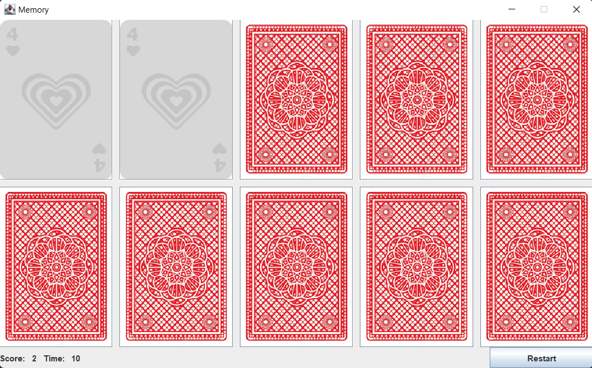

# Memory

Java implementation of Memory game.



## Description
Memory Game, also known as the Concentration card game or Matching Game, is a simple card game where you need to match pairs by turn over 2 cards at a time.

## Built with:
- Java
- SQLite
- Log4j


## Getting started
Requirements:
- Java 17
- Maven

Get started with a project:
- Clone the repository
```
git clone https://github.com/pmarek2k/Memory
```